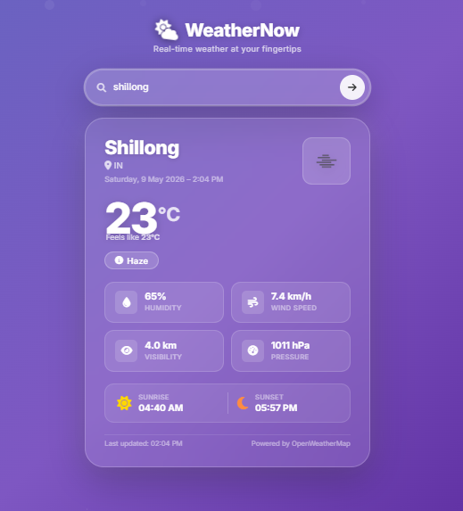
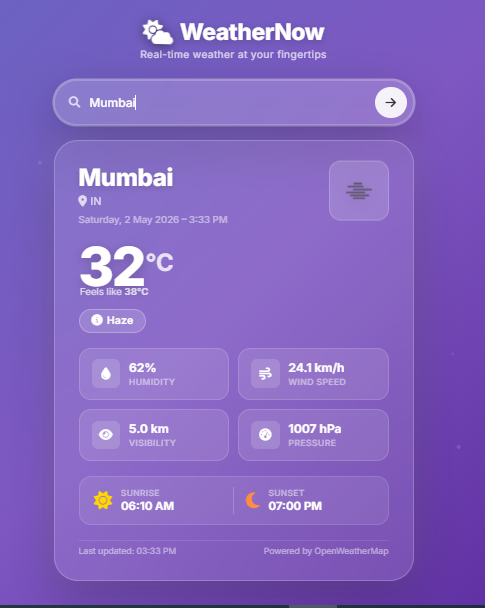
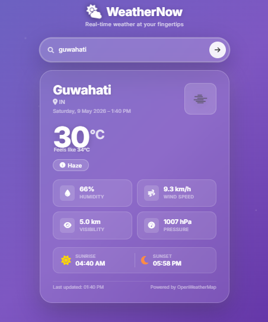

# 🌦️ WeatherNow – Real-Time Weather App

A responsive weather application that fetches real-time weather data using OpenWeatherMap API.

## 🚀 Features
- Search weather by city
- Real-time temperature, humidity, wind speed
- Sunrise & sunset timing
- Dynamic UI themes based on weather
- Local storage (remembers last search)

## 🛠️ Tech Stack
- HTML
- CSS
- JavaScript (Vanilla)
- OpenWeatherMap API

## 📸 Preview

## 🌐 Live Demo
https://fenil-1807.github.io/Weather_App/

## ⚙️ Setup
1. Clone the repo
2. Add your API key in `script.js`
3. Open with Live Server

---

Made by Fenil 🚀